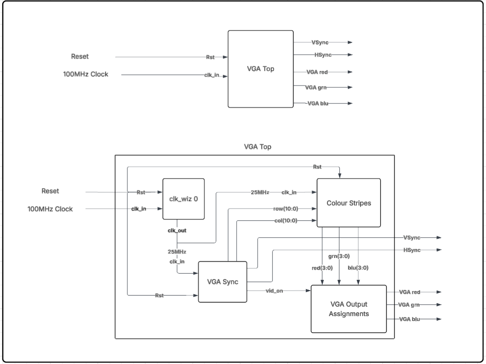
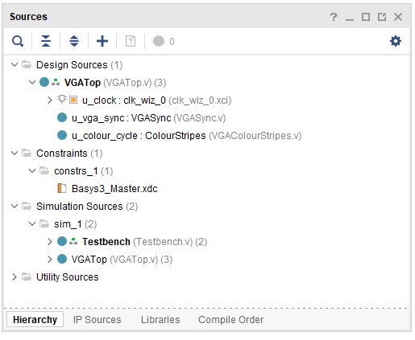
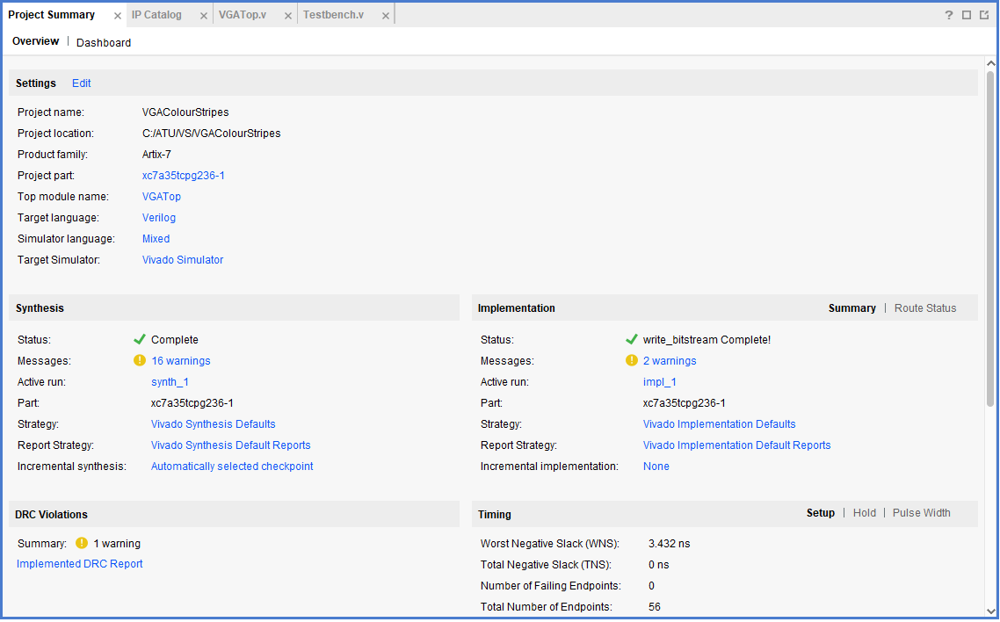
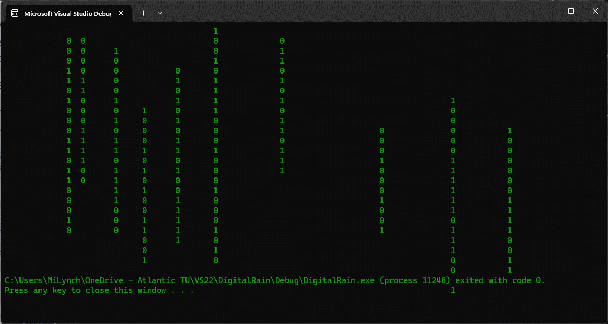
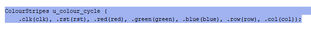
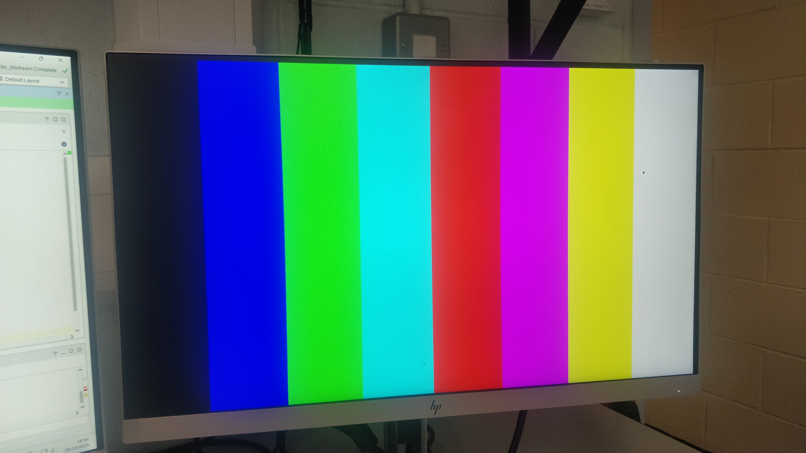
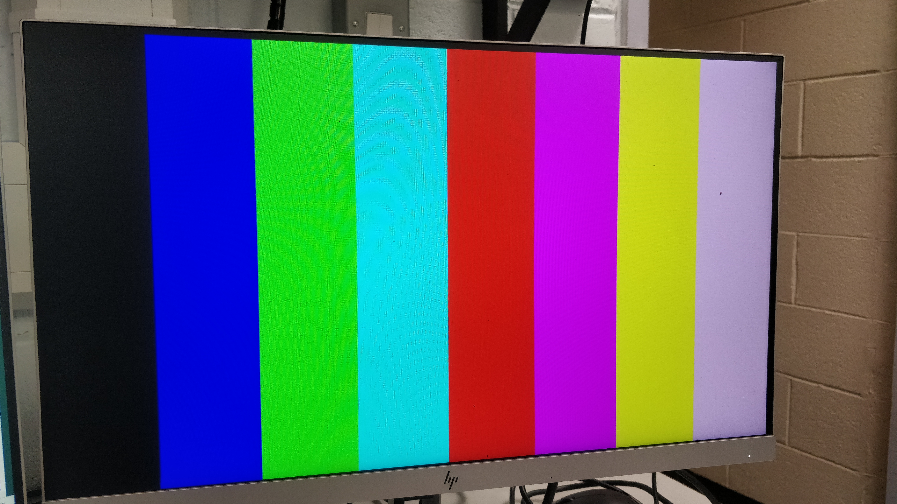
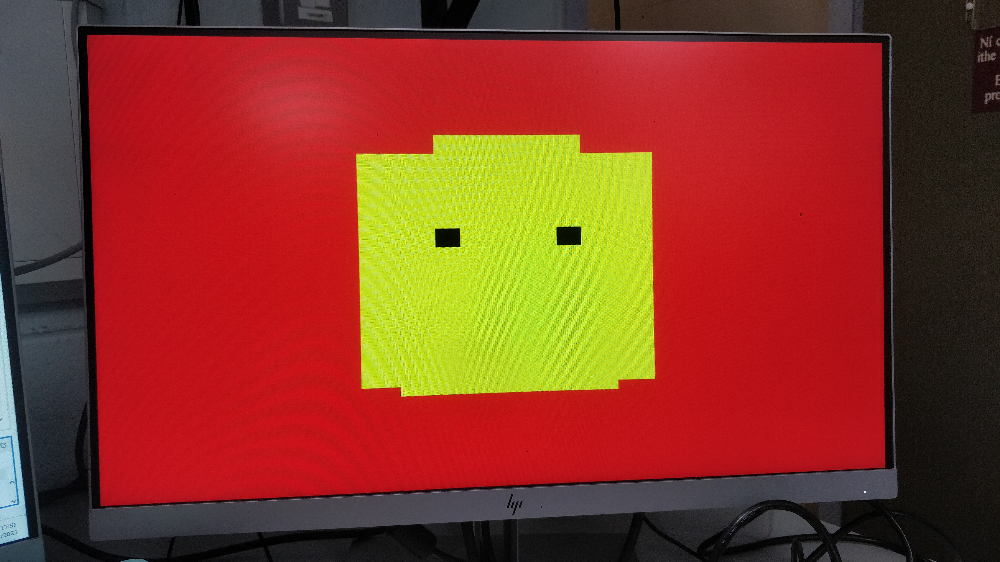

 
# *The TV Screen LIES....!!!!*
Okay maybe “lies” is a bit dramatic, but the screen does fool our brains. What we see as a complete stable image is really the result of thousands of pixels whose red, green, and blue sub-pixels change intensity every frame. As these rapid changes play out across the screen, our brains blend them into smooth motion and solid colours.

Older display technologies like CRTs took this even further, they literally scanned the image line by line from top to bottom, then jumps back to the start to repeat the process. Each pass built up the image so quickly that the way frames blur together made it appear continuous.

# This webpage is documenting the progress of my FPGA VGA Project

## *Project Set Up*

### *BASYS3 Develoment Board*

This FPGA VGA Project has shown me at code level how VGA displays operate. Through the refresh rate of the screen, it is essentially tricks our brains into thinking we see a complete image when actually we are watching a trace of each pixel’s subpixels red, green and blue(RGB) with intensities that change per frame to generate varying colours which then as the trace makes its way across and down the screen to the end allowing us to see a complete image and then returns to the start to repeat the process.

### *VGA Top Architecture Diagram*

### *Project Sources window*

### *Project Summary window*

### *Template Code*
The Verilog code templates are designed to generate visual patterns, including a colour cycle screen wash, horizontal colour rows, and vertical columns. These signals follow the standard VGA timing scheme, which scans the screen left to right and top to bottom. The pixel coordinates are then passed to VGA Top, which determines what colour should be displayed at each point on the screen. 

One template produces a colour cycle wash, demonstrating how the pixel RGB values can be changed frame by frame and in turn the displayed colour changes. Other templates generate colours in horizontal rows and vertical columns. In each case the colour selection logic uses the pixel coordinates from the VGA controller to decide which colour to output, allowing simple patterns to be drawn without the need to store a full frame buffer.

Rather than presenting a complete image at once, VGA displays work by continuously scanning the screen, these templates rely on timing accurate signals rather than stored images. The Verilog modules recreate VGA behaviour by generating the correct HSYNC and VSYNC timing signals, including the active video period, front porch, sync pulse, and back porch. Together these timings tell the monitor exactly when to draw pixels, move to the next line, and start a new frame.

# (add screenshots) 

### **Simulation**
Simulation is used to verify the VGA clock timing generator and colour pattern modules before programming the FPGA. The Verilog design is run in a waveform simulator, where the horizontal and vertical sync pulses, pixel coordinates, and colour outputs can be observed to see how they interact over time. This allows any timing errors or incorrect colour selection to be identified early, providing visual confirmation that the design follows the expected VGA timing sequence.

The simulation also demonstrates how the colour pattern logic responds to changing pixel coordinates, for example producing the colour cycle wash, or row and column based patterns. By displaying these signals in the waveform viewer, it would become clear that the modules generate valid RGB values throughout each frame, giving confidence that the design would operate correctly when synthesised. 

Unfortunately, I was running behind with my progress due to missing a couple of labs, so to try and save time I skipped straight to full implementation and programmed the board for testing. I used the default case to apply colour to any pixel not explicitly driven by the pattern logic, avoiding the need to manually define each region of the background. This allowed me to focus on colouring my icon in the centre of the screen.

### *Rows Simulation Screenshot*
*Unfortunatley I didn't run the simulation at the time, as you can see it doesn't show any pulsing signals just solid lines* 

### *Screenshot Example of a Correct Rows Simulation*

### *Project Source window with error*
*There was a fault in Simulation Sources/ Testbench/ i_colour_stripes : xil_defaultlib.ColourStripes this is why I can't show a functional simulation(see below in image)*

### **Synthesis**
Synthesis and implementation were performed using Vivado, where the Verilog code is changed into hardware logic and mapped onto the device. 
During synthesis, Vivado checks the design for timing constraints, optimises the logic, and reports utilisation statistics like look up tables (LUTs), flip-flops, and I/O pins. 

The implementation stage then places and routes the design, ensuring that the VGA pixel clock and sync signal timing meet the required specifications. Once the design passes these checks, the bitstream is generated and programmed onto the FPGA board, where the VGA output can be tested in real time on the monitor. This process confirms that the simulated behaviour will be correctly displayed on the physical hardware.

## **My VGA Design Edit**
# (Introduce your own design idea. Consider how complex/achievabble this might be or otherwise. Reference any research you do online (use hyperlinks).)

### **Code Adaptation**
Adapting the code to display my designs at first I thought would be easy... 

*Yeah, should be easy enough and I'll do something like..... my lecturer's binary rain...* 

*...but once I started I quickly realised it wasn’t.* Because generating the bitstream takes time, every test requires patience, which makes it important to get the code right before attempting to program the board. Many times I thought I had solved the problem, only to find that the hardware produced something completely unexpected.

For my FPGA VGA project, initially I set up the project with the downloaded template files which displayed colours cycling 

### *ColourCycling video link* 

and then progressed to the second step to display colour stripes through the VGA I added rows and coloumns to the copied colourcycle Verilog code to create the stripes Verilog code, see below updated code *`.row(row), .col(col)`*

### *Stripes VGA Design*
 

Following that I began to modifiy the supplied stripes template to show a different image. Firstly I experimented until I got the colour I was looking for, 

then I split the screen into three vertical regions and used the column value (col) to switch between green, white, and orange. For each column, I set the RGB intensities, which kept the colours clean and consistent across the width of the screen.

By adjusting the column ranges and their RGB values, the template now displays a simple tricolour flag rather than the default design. Working through this made it clear to me how the pixel-generation logic works — each pixel’s colour is determined by its position, so changing those ranges or intensity values immediately changes what appears on screen(see below).

### *Demonstration*
This demo displays the Irish Flag, which I selected as the design pattern. 

Example of actual code used

*`if`*

*`(col >= 11'd0 && col <11'd213) begin`*

  
 *`red_next   <= 4'b0000;`*    
 *`green_next <= 4'b1111;`*    
 *`blue_next  <= 4'b0000;`*
      
  *`end`*
   
  *`else if`*
   
*`(col >= 11'd213 && col < 11'd426) begin`*
  
   
  *`red_next   <= 4'b1111;`*     
  *`green_next <= 4'b1111;`*     
  *`blue_next  <= 4'b1111;`*
     
  *`end`*
   
  *`else if`*
   
*`(col >= 11'd426 && col < 11'd640) begin`*
 

   
   *`red_next   <= 4'b1111;`*   
   *`green_next <= 4'b0111;`*   
   *`blue_next  <= 4'b0000;`*   
     
  *`end`*

## *Experimenting*

### *Horizontal Flag*

### *Understanding how it works*

### *Final Design*
I didn't get my design finished but I learned quite a bit about how VGA actually works at a coding level.
 

### *The expected finished design*
I almost did though and if I had it would have looked something like this....

### *References*
