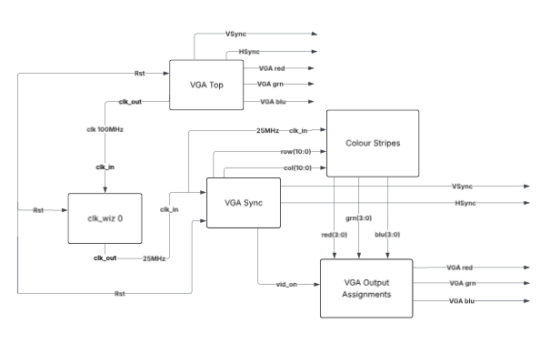
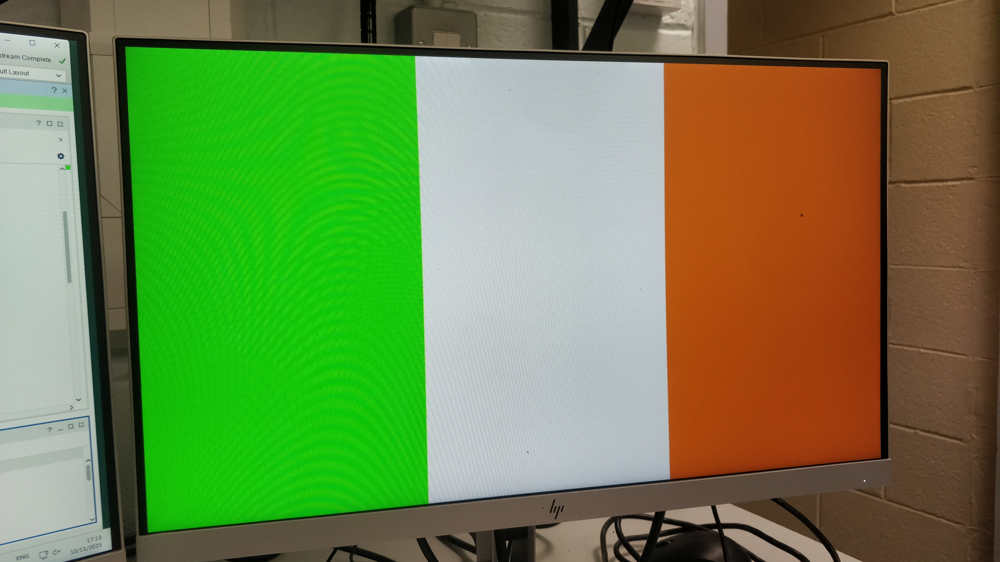

(Add a short welcome message or introduction here. Aim to get the viewer interested in what follows! Guideline: 1 or 2 sentences.CHECKED) 
# *The TV Screen LIES....!!!!*
Okay maybe “lies” is a bit dramatic. But the screen does fool our brains. What we see as a complete, stable image is really the result of thousands or millions of pixels whose red, green, and blue sub-pixels change intensity every frame. As these rapid changes play out across the screen, our brains blend them into smooth motion and solid colors.

Older display technologies like CRTs took this even further, they literally scanned the image line by line from top to bottom, then jumped back to the start to repeat the process. Each pass built up the image so quickly that persistence of vision made it appear continuous.

# This Web page is documenting the progress of my FPGA VGA Project

For my FPGA VGA project, initially I set up the project with the downloaded template files which displayed Colours cycling 

# <"insert image/video"> (remove audio before adding) 

and then progressed to the second step to display colour stripes through the VGA I added rows and coloumns to the stripes Verilog code, see below updated code *`.row(row), .col(col)`*

## **Template VGA Design**
### **Project Set-Up**
# (Summarise the project set-up and design flow.CHECKED) 

This FPGA VGA Project is showing me at a code level how VGA displays operate. Through the refresh rate of the screen, it is essentially fooling our brains into thinking we see a complete image when actually we are watching a trace of each pixel’s subpixels RGB with intensities that change per frame to generate varying colours which then as the trace makes its way across and down the screen to the end and returns to the start to repeat the process allowing us to see a complete image.

# (Guideline 1 short paragraph.)

**Architecture Diagram**

**Architecture Diagram**

**Project Summary window**

### **Template Code**
# (Outline the structure and design of the Verilog code templates you were given. What do they do? Include reference to how a VGA interface works. Guideline: 2/3 short paragraphs,CHECKED) 

The Verilog code templates are designed to generate visual patterns, including a colour cycle screen wash, horizontal colour rows, and vertical columns. These signals follow the standard VGA timing scheme, which scans the screen left to right and top to bottom. The pixel coordinates are then passed to VGA Top, which determines what colour should be displayed at each point on the screen. 

One template produces a colour cycle wash, demonstrating how the pixel RGB values can be changed frame by frame and in turn the displayed colour changes. Other templates generate colours in horizontal rows and vertical columns. In each case the colour selection logic uses the pixel coordinates from the VGA controller to decide which colour to output, allowing simple patterns to be drawn without the need to store a full frame buffer.

Because rather than presenting a complete image at once, VGA displays work by continuously scanning the screen, these templates rely on timing accurate signals rather than stored images. The monitor reconstructs the picture as the signal sweeps across the screen, the Verilog modules mimic this behaviour by producing the correct timing through VGA sync. 

# (add screenshots)

### **Simulation**
Simulation is used to verify the VGA clock timing generator and colour pattern modules before programming the FPGA. The Verilog design is run in a waveform simulator, where the horizontal and vertical sync pulses, pixel coordinates, and colour outputs can be observed to see how they interact over time. This allows any timing errors or incorrect colour selection to be identified early, providing visual confirmation that the design follows the expected VGA timing sequence.

The simulation also demonstrates how the colour pattern logic responds to changing pixel coordinates, for example producing the colour-cycle wash, or row and column based patterns. By displaying these signals in the waveform viewer, it would become clear that the modules generate valid RGB values throughout each frame, giving confidence that the design would operate correctly when synthesised. 

Unfortunately, I was running behind with my progress due to missing a couple of labs, to try and save time I skipped straight to full implementation and programmed the board for testing. I used the default case to apply colour to any pixel not explicitly driven by the pattern logic, avoiding the need to manually define each region of the background. This allowed me to focus on colouring my icon in the centre of the screen.

### **Synthesis**
Synthesis and implementation were performed using Vivado, where the Verilog code is changed into hardware logic and mapped onto the device. 
During synthesis, Vivado checks the design for timing constraints, optimises the logic, and reports utilisation statistics like look up tables (LUTs), flip-flops, and I/O pins. 

The implementation stage then places and routes the design, ensuring that the VGA pixel clock and sync signal timing meet the required specifications. Once the design passes these checks, the bitstream is generated and programmed onto the FPGA board, where the VGA output can be tested in real time on the monitor. This process confirms that the simulated behaviour will be correctly displayed on the physical hardware.

### **Demonstration**
This demo displays the Irish Flag, which I selected as the design pattern. 

(Guideline: 1/2 sentences.)

## **My VGA Design Edit**
# (Introduce your own design idea. Consider how complex/achievabble this might be or otherwise. Reference any research you do online (use hyperlinks).)

As Ecah pixel has to be covered by code in regards to its colour and I was running behind with my progress due to missing a couple of labs 
I decided to use the default section to colour the background and left my icon essentially floating in the centre of the screen, as whatever colour you decide to make the default, will colour any pixel not covered by the code. as this saved time rather than trying to write each section individually.

### **Code Adaptation**

Adapting the code to display my designs at first I thought would be easy... 

*Yeah, should be easy and I'll do something like..... my lecturer's binary rain* 

but once I started I quickly realised it wasn’t. Because generating the bitstream takes time, every test requires patience, which makes it important to get the code right before attempting to program the board. Many times I thought I had solved the problem, only to find that the hardware produced something completely unexpected.

I started with the supplied stripes template and modified it to show a different image. Instead of the original pattern, I split the screen into three vertical regions and used the column value (col) to switch between green, white, and orange. For each column, I set the RGB intensities, which kept the colours clean and consistent across the width of the screen.

By adjusting the column ranges and their RGB values, the template now displays a simple tricolour flag rather than the default design. Working through this made it clear to me how the pixel-generation logic works — each pixel’s colour is determined by its position, so changing those ranges or intensity values immediately changes what appears on screen.

if(col >= 11'd0 && col <11'd213) begin

      red_next   <= 4'b0000;      
      green_next <= 4'b1111;
      blue_next  <= 4'b0000;
      
   end
   
   else if(col >= 11'd213 && col < 11'd426) begin
   
      red_next   <= 4'b1111;
      green_next <= 4'b1111;
      blue_next  <= 4'b1111;
   end
   
   else if(col >= 11'd426 && col < 11'd640) begin
   
      red_next   <= 4'b1111;
      green_next <= 4'b0111;
      blue_next  <= 4'b0000;
   end

### **Simulation**

# (Show how you simulated your own design. Are there any things to note? Demonstrate your understanding. Add a screenshot. Guideline: 1-2 short paragraphs.CHECKED)

### **Synthesis**
# (Describe the synthesis & implementation outputs for your design, are there any differences to that of the original design? Guideline 1-2 short paragraphs.)

### **Demonstration**
 I didn't get my design finisherd but I learned quite a bit about how VGA actually works at a coding level.

# (If you get your own design working on the Basys3 board, take a picture! Guideline: 1-2 sentences.)

##( **More Markdown Basics**)
# (This is a paragraph. Add an empty line to start a new paragraph.)

(Font can be emphasised as *Italic* or **Bold**.)

Code can be highlighted by using `backticks`.

Hyperlinks look like this: [GitHub Help](https://help.github.com/).

A bullet list can be rendered as follows:
- vectors
- algorithms
- iterators

Images can be added by uploading them to the repository in a /docs/assets/images folder, and then rendering using HTML via githubusercontent.com as shown in the example below.

